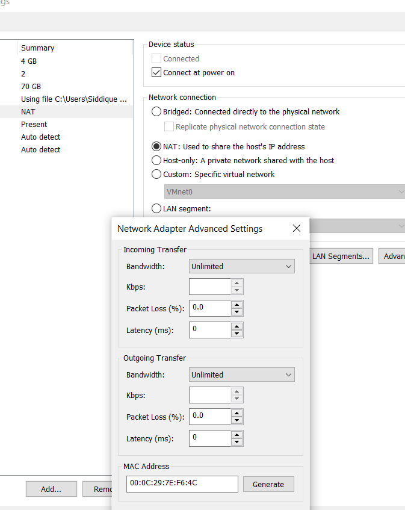
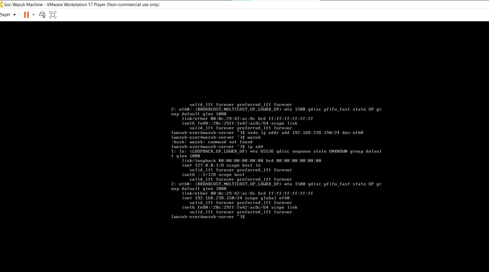
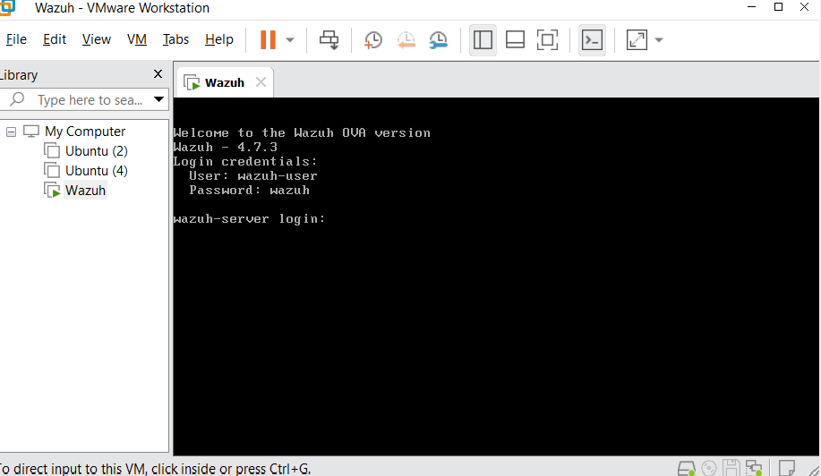
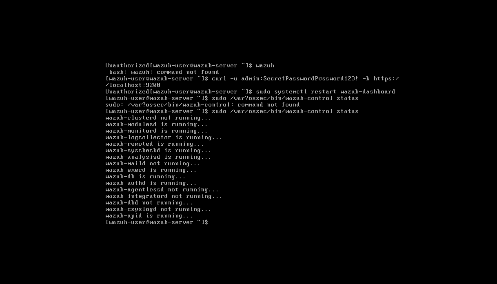
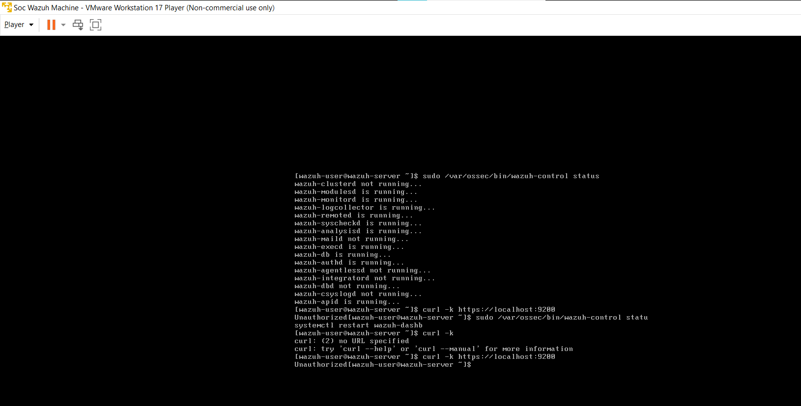

# Wazuh-SIEM-SOC-Lab
Automated SOC Lab Deployment and File Integrity Monitoring (FIM) Verification.
# 🛡️ SOC Lab: Wazuh SIEM Deployment & FIM Verification

## 📌 Project Overview
This project demonstrates the hands-on deployment of an open-source **Security Operations Center (SOC)** environment using **Wazuh**. I successfully configured a centralized monitoring system to analyze logs and maintain system integrity through **File Integrity Monitoring (FIM)**.

## 🛠️ Technical Stack & Tools
* **SIEM:** Wazuh (Manager, Indexer, Dashboard)
* **OS:** Linux (Ubuntu/Kali)
* **Virtualization:** VMware Workstation
* **Core Skills:** Linux Administration, Network Troubleshooting, SIEM Configuration

## 🚀 Implementation Steps
1. **Environment Setup:** Deployed a virtual machine with a static IP configuration to ensure stable communication between security components.
2. **Automated Deployment:** Utilized the Wazuh installation assistant to deploy the full stack (Indexer, Server, Dashboard).
3. **Service Verification:** Verified the status of `wazuh-manager` and `wazuh-indexer` backend services.
4. **Security Testing:** Validated **File Integrity Monitoring (FIM)** using `syscheckd` to monitor unauthorized changes in critical system directories.

# 📸 Lab Implementation & Evidence

### Step 1: Environment Configuration
Setting up the virtualized environment with optimized network settings to ensure SIEM connectivity.

### Step 2: Network & IP Management
Configuring a static IP on the Wazuh server to maintain consistent communication between agents and the manager.

### Step 3: Wazuh Deployment Success
Successful deployment of the Wazuh OVA/Package. The system is ready with default credentials.

### Step 4: Backend Service Verification
Verifying that all core modules (Analysisd, Remoted, Syscheckd) are operational. This confirms the SIEM is actively monitoring.

### Step 5: Dashboard & API Validation
Testing the connection to the Wazuh API and Indexer to ensure the web dashboard can visualize incoming security events.

---
**Contact:** https://www.linkedin.com/in/muzammil-sethar/
